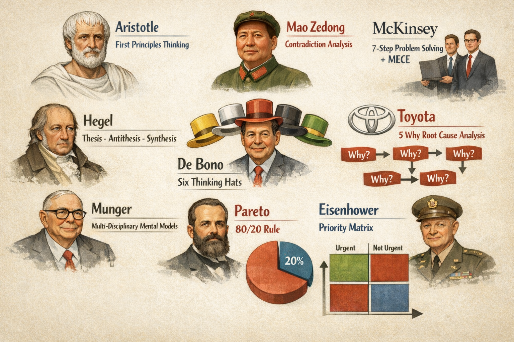

# nine-dimensions

[English](./README.md) | [中文](./README.zh-CN.md)

A Claude Code skill for complex decisions, strategic planning, problem diagnosis, and personal growth.



Instead of giving surface-level advice, `nine-dimensions` reframes a problem through nine classic thinking models:

1. Aristotle - First Principles Thinking
2. Mao Zedong - Contradiction Analysis
3. McKinsey - 7-Step Problem Solving + MECE
4. Toyota - 5 Why Root Cause Analysis
5. Hegel - Thesis, Antithesis, Synthesis
6. De Bono - Six Thinking Hats
7. Munger - Multi-Disciplinary Mental Models
8. Pareto - 80/20 Rule
9. Eisenhower - Priority Matrix

Typical questions this skill is designed for:

- Should I quit my job to start a company?
- Why does this problem keep repeating?
- Why is the team not aligning?
- How should this strategy or plan be designed?
- What should I prioritize, delay, delegate, or stop?

## What This Repository Is

This repository now contains a real **skill**, not an OpenClaw plugin.

Its goal is not to decide for the user, but to help the AI produce structured thinking around:

- the real problem
- the main contradiction
- the critical few factors
- the root cause chain
- action priorities
- the decisions the user still needs to make

## When To Use It

- major decisions
- strategic planning
- complex problem diagnosis
- interpersonal or collaboration analysis
- personal growth and career choices

## Framework Depth

The skill supports three levels of depth:

- `four-questions`
  Best for quick judgment, technical issues, and simple decisions
- `six-dimensions`
  The default for most medium-complexity problems
- `nine-dimensions`
  Best for high-impact, high-uncertainty, major decisions

If a problem does not need the full nine dimensions, use the flexible combination guide and choose the smallest useful set of models.

## Quick Start

Recommended workflow:

1. Read [SKILL.md](/Users/dylonluo/Downloads/CognitivePilot-main/SKILL.md) for triggers, depth selection, and output rules.
2. Choose the right prompt based on problem complexity:
   `four-questions`, `six-dimensions`, or `nine-dimensions`
3. If the case is unusual or time-constrained, use [flexible-combinations.md](/Users/dylonluo/Downloads/CognitivePilot-main/flexible-combinations.md).
4. If you want a consistent output style, check the matching examples in `examples/`.

## Install

This is a Claude Code custom skill, not a plugin.

Claude Code discovers skills from:

- project scope: `.claude/skills/<skill-name>/`
- personal scope: `~/.claude/skills/<skill-name>/`

### Install for one project

```bash
mkdir -p .claude/skills
cp -R /path/to/nine-dimensions .claude/skills/nine-dimensions
```

Then start a new Claude Code session in that project.

### Install globally

```bash
mkdir -p ~/.claude/skills
cp -R /path/to/nine-dimensions ~/.claude/skills/nine-dimensions
```

Then restart Claude Code or open a new session.

### Local development sync

```bash
mkdir -p ~/.claude/skills
rsync -av --delete /path/to/CognitivePilot-main/ ~/.claude/skills/nine-dimensions/
```

After each update, sync again and start a new session.

### Verify It Works

Try prompts like:

- `Help me do a nine-dimensions analysis`
- `Should I quit my job to start a company?`
- `Why does this problem keep repeating?`
- `Analyze this with first principles and contradiction analysis`

If installation is correct, Claude Code should discover and use this skill when relevant.

## Repository Structure

```text
.
├── SKILL.md
├── prompts/
│   ├── four-questions.md
│   ├── six-dimensions.md
│   └── nine-dimensions.md
├── examples/
│   ├── technical.md
│   ├── interpersonal.md
│   └── strategic.md
├── flexible-combinations.md
└── README.zh-CN.md
```

## Files

- [SKILL.md](/Users/dylonluo/Downloads/CognitivePilot-main/SKILL.md)
  Main skill entry: triggers, framework selection, output rules
- [prompts/four-questions.md](/Users/dylonluo/Downloads/CognitivePilot-main/prompts/four-questions.md)
  Quick framework for simple cases
- [prompts/six-dimensions.md](/Users/dylonluo/Downloads/CognitivePilot-main/prompts/six-dimensions.md)
  Default framework for medium-complexity cases
- [prompts/nine-dimensions.md](/Users/dylonluo/Downloads/CognitivePilot-main/prompts/nine-dimensions.md)
  Full deep-analysis framework for high-impact decisions
- [flexible-combinations.md](/Users/dylonluo/Downloads/CognitivePilot-main/flexible-combinations.md)
  Guidance for choosing the smallest useful combination of models
- [examples/technical.md](/Users/dylonluo/Downloads/CognitivePilot-main/examples/technical.md)
  Technical example
- [examples/interpersonal.md](/Users/dylonluo/Downloads/CognitivePilot-main/examples/interpersonal.md)
  Interpersonal example
- [examples/strategic.md](/Users/dylonluo/Downloads/CognitivePilot-main/examples/strategic.md)
  Strategic example
- [README.zh-CN.md](/Users/dylonluo/Downloads/CognitivePilot-main/README.zh-CN.md)
  Chinese version of the repository homepage

## Current Scope

- a reusable nine-dimensions skill
- a set of structured prompts
- a set of example outputs

This repository no longer contains the old plugin runtime code.
